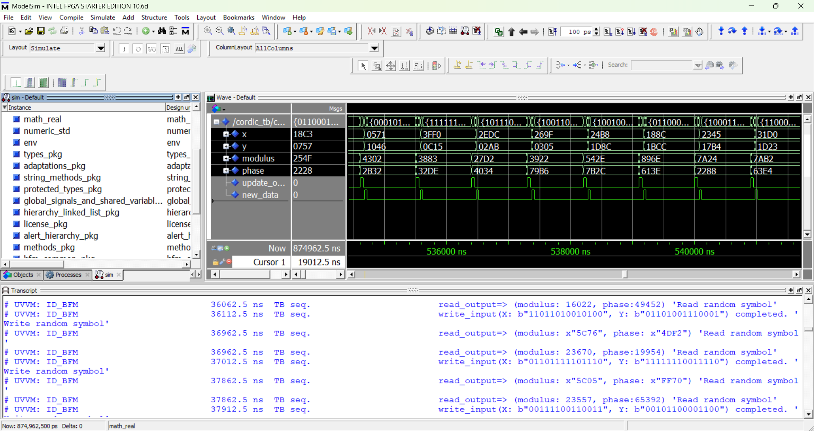

# CORDIC
An implementation, in VHDL, of CORDIC algorithm.

## Usage
In this repo there are two implementation of CORDIC algorithm: the former use a simple shift register
to provide the division by two, the latter use a barrel shift register. To use one or other checkout
to the relative branch.
```
git checkout <branch_name>
```
In the main branch, a report (for now only in italian) describe the implementation, synthesis with
Vivado (of both designs) and a numerical analysis for algorithm.

## License
This project is licensed under the MIT License - see the [LICENSE](./LICENSE) file for details.


